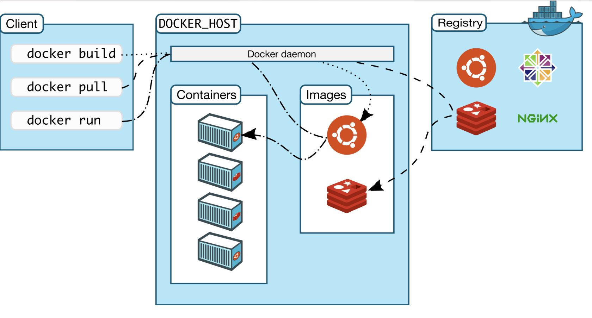
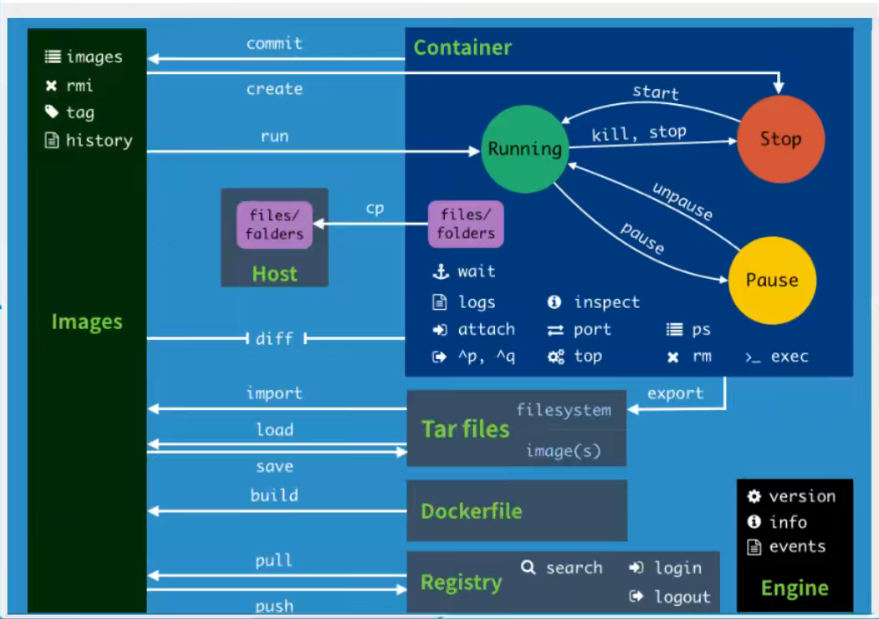

<div align=center><font face="黑体" size=6>Docker基础知识</font></div>

> Docker 学习

* Docker概述
* Docker安装
  * 额外知识：/etc/sysctl.conf 文件详解
* Docker命令
  * 镜像命令
  * 容器命令
  * 命令操作
* *Docker镜像*
* 容器数据卷
* DockerFile
* Docker网络原理
* IDEA整合Docker
* Docker Compose
* Docker Swarm

[toc]


# **1. Docker概述**

解决开发、测试、运维环境的一致性（开发即运维）

Docker 开发、打包、部署、上线，一套流程做完


Docker 通过隔离机制，可以尽可能利用服务器资源！


# 2. Docker 安装

#### 2.1 Docker的基本组成



**镜像（image）：**可以创建容器服务

**容器（container）：** 利用容器技术，独立运行一个或者一组应用，通过镜像来创建

**仓库（repository）：**存放镜像的地方





#### 2.2 安装Docker

系统环境Ubuntu Focal 20.04 (LTS)

##### 2.2.1 配置VirtualBox

配置网络环境，目标 宿主机、虚拟机A 、虚拟机B、外部网络 之间的网络均可以正常访问。

(1) 设置VirtualBox的网络管理器  (<font color=red>注意不要与宿主机同网段，宿主机为192.168.1.3，设置HostOnly网卡在192.168.1.x网段，导致虚拟机双网卡，不能链接互联网</font>)


(2) 设置具体的虚拟服务器网络 **<font color=red>网卡1为NAT 网卡2为Host-Only</font>**(顺序不能颠倒)，选择对应的虚拟网卡配置

(3) 修改Ubuntu操作系统网络配置文件

```yaml
vi /etc/netplan/00-installer-config.yaml

network:
  ethernets:
    enp0s3:
      dhcp4: true
    enp0s8:
      dhcp4: no
      addresses:
        - 192.168.56.100/24
  version: 2
```

(4) 执行netplan

```sh
netplan apply
```


> 其它：
>
> 新版本的Ubuntu 18以上系统，网络使用netplan，同时路由使用route table
>
> - route    查看路由表
> - ip route
>
>  更多信息查询，route路由表信息


(5) sudo 命令相关操作

```shell
使用visudo编辑权限文件， 也可以用vi
# 给用户添加sudo组
su root       -切换到root用户组   (Ubuntu无密码下切换到root， sudo -i )
# 打开sudoers添加sudo权限，也可以使用vim
visudo /etc/sudoers
# 添加admin用户的权限
%admin ALL=(ALL) ALL
# 设置sudo无密码， 给所有用户添加sudo 权限
%sudo ALL=(ALL:ALL) NOPASSWD:ALL


改完后就会生效，不需要source去执行

# 给用户添加不需要sudo便可以执行docker命令的的权限
(1) 第一种修改docker.sock权限，重启后失效
sudo chmod a+rw /var/run/docker.sock
(2) docker运行在docker组，可以将当前用户添加到用户组
id $USER   # 查看User基本信息
sudo groupadd docker #添加docker用户组
sudo gpasswd -a $USER docker #将登陆用户加入到docker用户组中
usermod -a -G docker $USER  #将登陆用户加入到docker用户组中
newgrp docker #更新用户组

注：visudo 操作命令 crtl + x 退出 crtl + o 保存文件 enter 确认保存的文件 
```

（6）Ubuntu 网络不通之 DNS错误

> 在Ubuntu 中即便使用正确的网络配置，当你的系统同时存在多个网络时，会出现DNS错误，导致网络连接错误。

**修改方法**

```yaml
# 修改netplan网络

network:
  ethernets:
    enp0s3:
      nameservers:
        addresses:
          - 8.8.8.8
      dhcp4: true
    enp0s8:
      dhcp4: no
      addresses:
        - 192.168.56.100/24
  version: 2
```


##### 2.2.2 安装Docker

> 参考链接： https://docs.docker.com/engine/install/

(1) 卸载旧版本

| 命令       | 功能                             |
| ---------- | -------------------------------- |
| apt remove | 会删除软件包而保留软件的配置文件 |
| apt purge  | 会同时清除软件包和软件的配置文件 |

```shell
# 修改apt-get源
vim /etc/apt/sources.list

# 默认注释了源码镜像以提高 apt update 速度，如有需要可自行取消注释
deb https://mirrors.tuna.tsinghua.edu.cn/ubuntu/ focal main restricted universe multiverse
# deb-src https://mirrors.tuna.tsinghua.edu.cn/ubuntu/ focal main restricted universe multiverse
deb https://mirrors.tuna.tsinghua.edu.cn/ubuntu/ focal-updates main restricted universe multiverse
# deb-src https://mirrors.tuna.tsinghua.edu.cn/ubuntu/ focal-updates main restricted universe multiverse
deb https://mirrors.tuna.tsinghua.edu.cn/ubuntu/ focal-backports main restricted universe multiverse
# deb-src https://mirrors.tuna.tsinghua.edu.cn/ubuntu/ focal-backports main restricted universe multiverse
deb https://mirrors.tuna.tsinghua.edu.cn/ubuntu/ focal-security main restricted universe multiverse
# deb-src https://mirrors.tuna.tsinghua.edu.cn/ubuntu/ focal-security main restricted universe multiverse

# 预发布软件源，不建议启用
# deb https://mirrors.tuna.tsinghua.edu.cn/ubuntu/ focal-proposed main restricted universe multiverse
# deb-src https://mirrors.tuna.tsinghua.edu.cn/ubuntu/ focal-proposed main restricted universe multiverse


# 卸载软件 
sudo apt-get purge docker-ce docker-ce-cli containerd.io

#删除镜像容器卷
 sudo rm -rf /var/lib/docker
 sudo rm -rf /var/lib/containerd
```

(2) 安装docker

```she
sudo apt-get install docker-ce docker-ce-cli containerd.io
```

(3) 测试运行docker

```shel
sudo docker run hello-world
```

(4) 其他命令

```
systemctl status docker 查看docker状态
systemctl start docker 开启docker服务
systemctl stop docker 关闭docker服务、

docker version 查看docker版本
docker images 查看镜像

docker ps   查看正在运行容器
docker ps -a  查看所有容器

docker rmi -f 镜像id
docker rm 容器id

docker rm -f ${docker ps -aq}
```

(5) 配置镜像仓库地址

```shell
sudo mkdir -p /etc/docker
sudo touch daemon.json
{
  "registry-mirrors": ["https://docker.mirrors.ustc.edu.cn"],
  # insecure-registries 私有仓库
  "insecure-registries": ["host:prt"],
  # docker 重启，container不停机
  "live-restore": true
}

#重启服务
sudo systemctl daemon-reload
sudo systemctl restart docker
```

(6) Linux 禁用swap分区

```shell
# 临时禁用吗，重启失效
swapoff -a

#启动交换分区
swapon -a

# 永久禁用
vi /etc/fstab
remove the line with swap keyword

# 查看内存使用情况
free -mh
```


##### 2.2.3 /etc/sysctl.conf 文件详解

使文件立刻生效命令：/sbin/sysctl -p

/proc/sys目录下存放着大多数内核参数，并且可以在系统运行时进行更改，不过重新启动机器就会失效。/etc/sysctl.conf是一个允许改变正在运行中的Linux系统的接口，它包含一些TCP/IP堆栈和虚拟内存系统的高级选项，修改内核参数永久生效。也就是说/proc/sys下内核文件与配置文件sysctl.conf中变量存在着对应关系。

``` shell
#  关闭swap分区，kubernetes环境必备
vm.swappiness = 0
# ElasticSearch环境必备
vm.max_map_count=655360
fs.file-max = 999999 
net.ipv4.tcp_tw_reuse = 1 
net.ipv4.tcp_keepalive_time = 60 
net.ipv4.tcp_fin_timeout = 30 
net.ipv4.tcp_max_tw_buckets = 5000 
net.ipv4.ip_local_port_range = 1024 61000 
net.ipv4.tcp_rmem = 4096 32768 262142 
net.ipv4.tcp_wmem = 4096 32768 262142 
net.core.netdev_max_backlog = 8096 
net.core.rmem_default = 262144 
net.core.wmem_default = 262144 
net.core.rmem_max = 2097152 
net.core.wmem_max = 2097152 
net.ipv4.tcp_syncookies = 1 
net.ipv4.tcp_max_syn.backlog = 1024
```


```shell
swapoff -a && swapon -a  清空是swap
然后执行 sysctl -p 命令,使上述修改生效。
```

参考连接：https://www.cnblogs.com/Jtianlin/p/4339931.html

​					https://www.cnblogs.com/soymilk2019/p/13725248.html


# 3. Docker命令

#### 3.1 Docker 架构


#### 3.2 Docker 命令

`docker version`  docker 版本信息

`docker info`  显示docker的系统信息，包括镜像和容器的信息

`docker <command> --help` docker命令帮助信息

参考链接：https://docs.docker.com/engine/reference/commandline/cli/

##### 3.2.1 镜像命令

`docker images` 查看所有镜像信息

`docker search <repository_name>`  从远程docker仓库搜索

`docker search mysql --filter=STARS=3000` 搜索STAR数量大于3000的docker镜像

`docker pull <image_name>`  docker image 镜像下载

<font color=red>`docker pull mysql 相等于 docker pull docker.io/library/mysql:latest`</font>

`docker rmi -f <image_id1> <image_id2> ... ` 删除镜像，递归删除

`docker rmi -f ${docker images -aq}  `  删除所有镜像，递归删除

##### 3.2.2 容器命令

```dockerfile
docker run [可选参数] <image_name> #启动镜像命令

# 参数说明
--name="Name"  #容器名字 区分容器
-d   # 后台运行
-it # 交互方式进入容器
-p  
-P  # dockerfile端口，不和主机link

docker run -it centos /bin/bash   #启动容器，并进入容器，以bash形式
docker ps -aq  # 显示所有容器id

docker exec -it <docker_id> /bin/bash    # busybox /bin/sh 进入容器需要一个进程挂起新的终端，所以有/bin/bash

docker attach <docker_id> # 进入的是正在运行的容器命令行，正在执行代码，不会启动新的进程，所以exit 会退出当前容器

ctrl +p +q # 退出当前容器，后台挂起

docker rm -f <docker_id>  # 强制删除 -f

# 启动和停止
docker start <docker_id>   # 启动
docker restart <docker_id>  # 重启
docker stop <docker_id>   # 停止
docker kill <docker_id> # 强制停止
```

##### 3.3.3 其他命令

**后台启动容器问题**

```shell
(1) 启动后停止
docker run -d centos   # 后台启动容器，当发现容器中无进程运行时会自动关闭
docker run -itd centos /bin/bash  # 有交互的运行，则不会关闭

docker run -itd centos /bin/bash -c "while true;do echo mat;sleep 1;done"

(2)查看docker日志
docker logs -f -t --tail 10 <docker_id>
```

**容器中的信息**

`docker top <docker_id>` 查询docker 容器中的进程

`docker inspect <docker_id>` 查询docker 容器中的元数据

`docker cp /www/runoob <docker_id>:/www `  主机拷贝容器 （不需要像linux一样加 -r） 

`docker cp <docker_id>:/www /www/runoob  `  容器拷贝主机


> docker 还可以通过打同卷的方式同步数据  docker -v  
>
> `docker run -itd -v /test:/soft centos /bin/bash`


##### 3.3.4 实战

```shell
(1) nginx

docker run -d --name nginx01 -p 80:80 nginx

# 测试
curl locahost:80  

whereis nginx

vi /etc/nginx/nginx.connf

docker run -it --rm nginx   # 运行完后，会删除容器， 一般用作测试

(2) 多端口暴漏 elasticsearch

docker run -d --name elasticsearch -p 9200:9200 -p 9300:9300 -e "discovery.type=single-node" -e ES_JAVA_OPTS="-Xms64m -Xmx512m" elasticsearch:7.6.2

# --net somenetwork 连接一个container网络,名字为somenetwork
# -e 对docker环境变量的修改 等同与Dockerfile中的ENV

docker stats  # 查看docker容器 cpu 状态

(3) Docker Portainer 

docker run -d -p 8088:9000 --restart=always -v /var/run/docker.sock:/var/run/docker.sock --privileged=true portainer/portainer

# 验证安装
http://${HOST_IP}:8088/
```


# 4. Docker镜像

> UnionFS（联合文件系统）

是一种分层轻量级的文件系统，它支持文件系统分层叠加

容器层和镜像层 docker run 是在镜像层叠加了容器命令层

#### 4.1 docker 镜像制作

```shell
# 1. 通过docker cp 或者Dockerfile 启动修改镜像
# 2. 通过对container 进行tag标记，或者commit

# commit 镜像, 同git一样
docker commit -a="author_name" -m="first commit docker images" <container_id> <TAG>

# 打tag，和commit作用一样
docker tag <containerId> <tagName>

docker push/pull <tagName>
```

# 5. 容器数据卷

容器数据卷，为了解决容器停止或者删除数据丢失的问题，通过挂载Linux等系统的文件目录，容器删除和停止都不会丢失，多个容器之间也可以通向数据。

```shell
# 命令挂载目录
docker run  -v  本地目录:docker目录  容器

# 查看容器元数据
docker inspect <containerId>


# 创建mysql数据库并映射

docker run -d -p 3310:3306 -v /opt/mysql/conf:/etc/mysql/conf.d -v /opt/mysql/data:/var/lib/mysql -e MYSQL_ROOT_PASSWORD=123456 --name mysql_mat mysql:5.8
```


#### 5.1 Docker 具名挂载、匿名挂载和指定路径挂载

```shell
# 具名挂载
-v nginx:/etc/nginx # 指定了目录名，但没有指定主机位置

# 匿名挂载
-v /etc/nginx # 不指定容器外（主机的）挂载地址，会随机生成一个文件夹 

# 指定路径挂载
-v /opt/nginx:/etc/nginx

# 挂载设置读写权限
ro  # readOnly, 只能通过宿主机修改
rw  # readWrite

-v /opt/nginx:/etc/nginx:ro


# 查看docker 容器卷的地址
docker volume ls

# 查看具体位置
docker inspect <volume_id> # 元数据中的MountPoint， docker inspect 中的Source
```


#### 5.2 Dockerfile 脚本挂载

```dockerfile
FROM centos

# 挂载目录---- 挂载了两个目录[匿名挂载]
VOLUME ["volume01", "volume02"]

CMD echo "----end----"
CMD /bin/bash
```

`docker build -f <dockerfile_path> -t <tag>:<version>`


#### 5.3 数据卷容器

作用：--volumes-from 多个mysql数据同步， docker01 为数据卷容器


只要有任何一个容器使用容器目录，其他的容器就算被删除，文件还会存在，容器卷是挂载在一起的。


# 6. Dockerfile

* Dockerfile 命令 （可参考 [Dockerfile最佳实践](Dockerfile的最佳实践.md) 文档）

  ```dockerfile
  FROM centos
  MAINTAINER mat
  
  ENV MYPATH /usr/local
  WORKDIR &MYPATH
  
  RUN apt-get update && apt-get install
  RUN apt-get install vim
  RUN apt-get install net-tools
  
  EXPOSE 80
  
  CMD echo $MYPATH
  CMD echo "---end---"
  CMD /bin/bash
  ```

  

  

  

* docker build

* docker history <contianer_id>  查看构建命令过程

* docker push (推送到Dockerhub 或者 阿里云仓库)

  * 登录阿里云
  * 找到容器镜像服务
  * 创建命名空间
  * 创建镜像容器，点开后会有文档提示操作

> 样例：安装 jdk+tomcat

```dockerfile
FROM centos

COPY readme.text /usr/local/readme.txt

ADD jdk-8u11-linux-x64.tar.gz  /usr/local
ADD apache-tomcat-9.0.22.tar.gz  /usr/local

RUN apt-get install vim

ENV MYPATH /user/local
WORKDIR &MYPATH

ENV JAVA_HOME /usr/local/jdk1.8.0
ENV CLASSPATH $JAVA_HOME/lib/dt.jar:$JAVA_HOME/lib/tools.jar
ENV CATALINA_HOME /usr/local/apache-tomcat-9.0.22
ENV CATALINA_BASE /usr/local/apache-tomcat-9.0.22
ENV PATH $PATH:$JAVA_HOME/bin:$CATALINA_HOME/lib:$CATALINA_HOME/bin

EXPOSE 8080
CMD /usr/local/apache-tomcat-9.0.22/bin/startup.sh && tail -F $CATALINA_HOME/bin/logs/catalina.out
```


# 7. Docker网络原理

> 理解Docker0

启动docker服务后，docker会在Linux系统中创建docker0 网卡，用来路由宿主机和容器、容器与容器之间的网络连接。

每次启动一个容器，会发现创建了一个网卡，使用evth-pair技术，创建网卡成对出现 6-5、8-7


```shell
# docker网卡创建成对出现
# evth-pair 技术，成对出现一端连着协议栈，一端彼此相连着（veth-pair 还不是很懂）

# 容器之间ping
docker exec -it docker01 ping xxx.xxx.xxx.xxx

docker容器之间使用桥接， docker和物理网卡间是直连NAT

NAT参考资料：https://www.zhihu.com/question/31332694
```


> 通过容器名字访问容器ip地址 --link

```shell
# --link 存在的问题
docker network --help   # 查看所有网络命令
docker network inpsect <network_id>

# 使用名字docker02 可以ping通docker01 ，但反之不通
docker run -it --name docker02 --link docker01 tomcat
# --link 原理，实际是在host文件中加入例如docker01的映射
```


#### 7.1 Docker自定义网络

> 查看docker网络 docker network ls
>
> 自定义网路好处： 不使用--link 可以通过container name 直接ping其他container

网络模式：

* bridge 桥接模式 (默认)
* none 不配置网络
* host 和宿主机共享网络
* container 容器网络联通

```shell
# docker run 启动默认会 --net bridge，默认使用docker0,下面两条命令作用相同
docker run -d -P --name docker01 tomcat
docker run -d -P --name docker01 --net bride tomcat 


# 创建网络
docker network create --driver bridge --subnet 192.168.0.0/16 --gateway 192.168.0.1 mynet

docker run -d -P --name docker01 --net mynet tomcat_mat
docker run -d -P --name docker02 --net mynet tomcat_mat
#测试 
docker exec -it docker02 ping docker01
```

#### 7.2 多个网络之间，容器联通

```shell
# 连接一个网络 到容器
docker network connect <network_id> <contianer_id>
# 实际就是将 容器加入到 网络中，采用的是一个容器双网络口

# 样例
docker network connect mynet admiring_rhodes
```


# 8. 实战

#### 8.1 Redis分片集群搭建

##### 8.1.1 创建Redis集群配置文件

```SHELL
for port in $(seq 1 6); \
do \
mkdir -p redis/node-${port}/conf
touch redis/node-${port}/conf/redis.conf
cat > redis/node-${port}/conf/redis.conf << EOF 
port 6379 
bind 0.0.0.0
cluster-enabled yes 
cluster-config-file nodes.conf
cluster-node-timeout 5000
cluster-announce-ip 172.38.0.1${port}
cluster-announce-port 6379
cluster-announce-bus-port 16379
appendonly yes
EOF
done
```

##### 8.1.2 启动容器构架集群

```shell
1. 启动6个redis容器

docker run -p 637${port}:6379 -p 1637${port}:16379 --name redis-${port} \
-v redis/node-${port}/data:/data \
-v redis/node-${port}/conf/redis.conf:/etc/redis/redis.conf \
-d --net redis --ip 172.38.0.1${port} redis:5.0.9 redis-server /etc/redis/redis.conf

2. 构建集群

# 进入容器内，执行命令
redis-cli --cluster create 192.38.0.1${1}:6379 192.38.0.1${2}:6379 192.38.0.1${3}:6379 192.38.0.1${4}:6379 192.38.0.1${5}:6379 192.38.0.1${6}:6379 --cluster-replicas 1
```


##### 8.1.3 连接redis集群

```shell
# 进入容器内执行
redis-cli  # 进入单机的redis
redis-cli -c  # 进入集群的redis 连接

# 进入redis集群
>  cluster info # 查看集群信息
>  cluster nodes # 查看节点信息
>  set a b     # 可以看到进入那个slot
>  get a       # 可以看到从那个slot取
```


#### 8.2 IDEA项目打包镜像

```dockerfile
FROM java:8
COPY *.jar /app.jar
CMD ["--server.port=8080"]
EXPOSE 8080
ENTRYPOINT ["java", "-jar", "/app.jar"]
```


# 9. Docker Compose

Docker Compose 是用来定义和运行多个容器，Docker Compose 运行的三个基本环节：

- 定义运行程序的Dockerfile 环境及文件
- 运用docker-compose.yml文件来定义一组服务，服务都运行在隔离的环境中
- 通过 `docker-compose up`  运行
  - docker-compse down

核心作用: 批量容器编排，属于单服务器编排多个容器


#### 9.1 Docker Compose  安装

* 下载docker-compose执行文件
  * 国内地址`curl -L https://get.daocloud.io/docker/compose/releases/download/1.29.2/docker-compose-`uname -s`-`uname -m` > /usr/local/bin/docker-compose`
* 修改执行权限 `sudo chmod +x /usr/local/bin/docker-compose`
* `docker-compose version`


#### 9.2 Docker Compose 使用

```yaml
version: "3.9"
services:
  web:
    build: .
    ports:
      - "8000:5000"
  redis:
    image: "redis:alpine"
```

启动compose服务`docker-compose up -d`

`docker-compose down`

默认服务名: 文件名\_服务名\_副本数

网络默认名: 文件名\_default   网络中通过域名访问

`docker-compose up --build` 重新编译docker-compose 并运行

#### 9.3 yaml文件

>  docker-compse 文件核心三大块，配置参数参考https://docs.docker.com/compose/compose-file/compose-file-v3/

```yaml
version: '' #版本
services： # 服务同Dockerfile一样
	服务1: name
		images
		build
		network
		...
	服务2: name
		...
# 其他配置
networks:
volumes:
```

* depend_on 依赖启动当前服务时先要启动好的服务（启动优先级）


样例：https://docs.docker.com/samples/wordpress/


# 10. Docker Swarm

Docker Swarm 属于集群使用 Docker Compose 运行Docker

* 初始化集群`docker swarm init --advertise-addr ${public_ip}  `
* 加入初始化的集群以work `docker swarm join --token ${token} ${public_ip}:2377 `

* 使用`docker swarm join-token manager`命令生成 加入节点的命令，然后再客户机连接，加入成功变为manager节点

`sytemctl stop docker` 测试集群情况


#### 10.1 docker service

管理节点运行命令

* 创建服务
  * docker service create -p 8080:80 --name my-nginx nginx
  * docker  service  ls
  * docker service update --replicas 3 my-nginx  #扩缩容
  * docker service scale my-nginx=3   #扩缩容
* 动态扩展服务
* 更新服务


#### 10.2 docker swarm 命令

输入命令 ——> 管理 ——> api ——> 调度 ——> 工作节点


```shell
# service运行模式

--mode string Service mode (replicated, global, replicated-job, or global-job) (default "replicated")

replicated 模式，代表副本模式，global代表每个node都有

docker service create --mode replicated --name my-nginx nginx:7

docker service create --mode global --name my-nginx nginx
```


```shell
# 单机
docker-compose up -d xxx.yaml

# 集群
docker stack deploy xxx.yaml

# docker stack 配置文件
```


```shell
# docker 证书
docker secret

# docker config 配置
docker config
```

