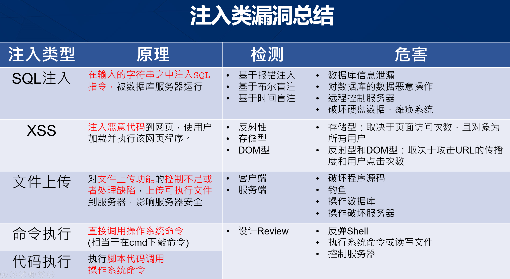
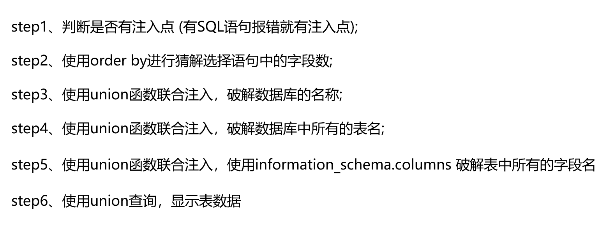
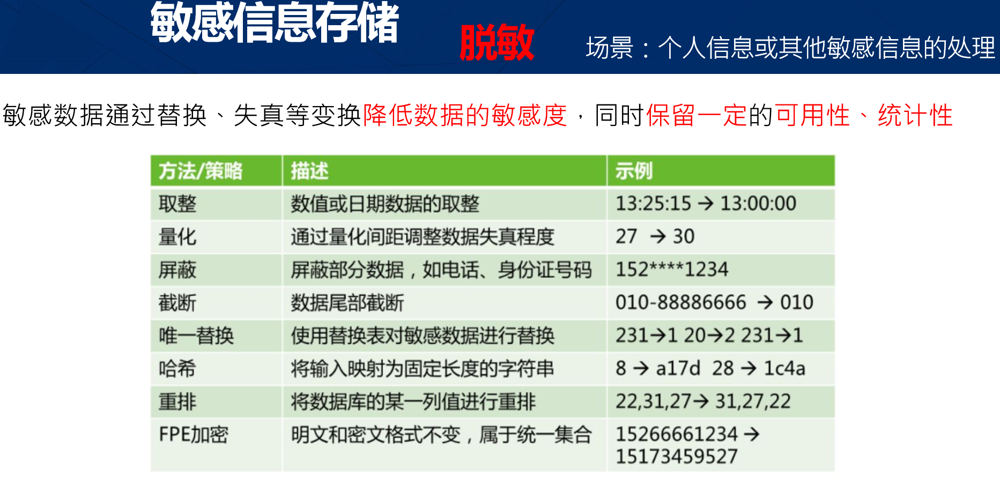

[TOC]



### 1.SQL 注入

SQL 注入类型：宽字节注入、联合注入、布尔注入、时间盲注（加入时间，通过延迟判断）、二次注入以及二次编码注入

SQL 注入的修复方法：限制用户输入的长度、限制用户输入的内容、对提交的参数进行预编译（参数化处理）


**防御** : 两限一不，参数化 （限制长度、限制类型、不拼接SQL、 参数化查询）

#### 1.1 SQL 注入_报错注入

根据SQL语句返回的异常错误信息，猜测sql语句，构造payload（恶意代码）进行注入。

##### 1.1.1 注入方式

猜测SQL 注入点后， 利用数据库函数 user()、 extractValue()、 database()等查询出用户的名称、数据等等。

##### 1.1.2 漏洞检测

关键字过滤、动态函数限制等。

#### 1.2 宽字节编码注入

根据字符变化，不同软件系统间处理的差异，进行权限提升或者数据库执行。如：UrlEncode

##### 1.2.1 漏洞修复

设置相同的编码格式，可以便面宽字节转换时的注入。如：Mysql

```my
set character_set_client = UTF-8
set character_set_connection = UTF-8
set character_set_results = UTF-8
```

#### 1.3 Union 注入



### 2.常见组件漏洞查询

#### 2.1 **常见漏洞**数据库：

CVE: https://cve.mitre.org/

NVD: https://nvd.nist.gov/ 

CPE: https://nvd.nist.gov/Products/CPE

CVSS: https://nvd.nist.gov/vuln/search 

CNVD: https://www.cnvd.org.cn/flaw/list.htm

CNNVD: http://cnnvd.org.cn/web/index.html

#### 2.2 漏洞验证

漏洞数据库中查询到的CVE编号， 拿到编号去 Github 或 官方网址中搜索已公布的 POC， 进行验证。

#### 2.3 漏洞修复

查看官方或CVE的修复措施。


### 3.文件注入

由于上传功能的控制不足或者处理缺陷，使得攻击者可以通过程序上传可执行文件到服务器，从而用户可以越过其本身权限执行脚本，进一步影响服务器安全。

#### 3.1 注入检测

* 检测扩展名（黑名单、白名单大小写检测）
* 检测文件内容（文件头木马检测、渲染/加载检测、多次渲染检测）

#### 3.2 漏洞成因

文件注入漏洞往往是因为配置或函数使用不当（PHP高发）、使用老旧的漏洞组件或解析执程序。

例如：

```
* 在 IIS5.x/6.0 中，在网站下建立名字为*.asp、*.asa、*.cer、*.cdx 的文件夹，那么其目录内的任何扩展名的文件都会被IIS当做asp文件来解释并执行

* 在 IIS5.x/6.0 中， 分号后面的内容不被解析，也就是说 xie.asp;.jpg 会被服务器当成xie.asp去执行。还有IIS6.0默认的可执行文件除了asp还包含 *.asa、*.cer、*.cdx
```

#### 3.3 漏洞修复

* 文件大小限制
* 后缀名限制
* 文件名重命名
* 上传接口文件回显路径限制
* 检测文件内容是否合法
* 其他权限系统限制


### 4.数据脱敏




