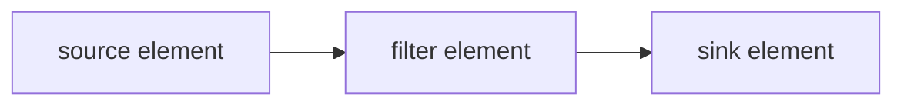
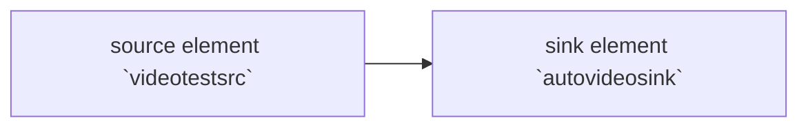

#### 2 Gstreamer 概念

> 在第1章教程展示了如何创建自动创建一个管道。在本章节我们将手动创建管道，初始化元素组件并将他们连接起来。在本本章节，我们将学习到：
>
> * 了解GStreamer元素组组件及创建
> * 元素组件件如何链接
> * 如何定义元素组件和组件的行为
> * 监听总线的错误情况，并从GStreamer消息抽取信息

##### 2.1 核心函数

###### 1. 管道

这些元素组件是GStreamer的基本构造块。它们在数据从源元素组件（数据生产者），通过过滤器元素组件处理吗，流向汇元素组件（数据消费者）的过程。



###### 2. 元素组件创建

这里跳过GStreamer初始化，初始化可以看上一个教程：

```c
 source = gst_element_factory_make ("videotestsrc", "source");
 sink = gst_element_factory_make ("autovideosink", "sink");
```

如这段代码所示，**gst_element_factory_make（)** 函数可以创建新的元素组件。第一个参数是要创建的元素类型（**基础教程14：**展示了一些常见的元素组件，**基础教程10：**GStreamer工具，显示了如何获取所有可用类型的列表）。第二个参数是我们想给这个实例起的名字，没用保留指针的情况下，名字可以被用来检索元素组件实例（更有意义的是debug的输出）。如果向参数传入NULL, GStreamer将会提供一个唯一的名字。

本教程创建了两个元素组件：`videotestsrc` 和 `autovideosink`，这张图中么有filter元素组件。管道图如下：



`videotestsrc`：是一个source元素组件，用于创建测试视频模式。此组件可用于调试，通常不在生产程序中使用。
`autovideosink`：是一个sink元素组件，它打开窗口显示它接收到的图像。根据操作系统的不同，这里存在几种具有不同功能的视频接收器。

`autovideosink`:会自动选择并实例化最佳的一个，所以不必担心细节，并且您的代码更加独立于平台。

###### 3. 管道创建

```c
/* Create the empty pipeline */
pipeline = gst_pipeline_new ("test-pipeline");
```

GStreamer中的所有元素通常必须包含在管道中才能使用，因为它负责一些时钟和消息传递的功能。通过函数gst_pipe_new() 来创建管道。

```c

```


##### 2.2 插件