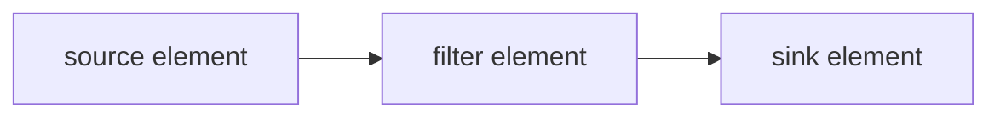

#### 2 Gstreamer 概念

> 在第1章教程展示了如何创建自动创建一个管道。在本章节我们将手动创建管道，初始化元素组件并将他们连接起来。在本本章节，我们将学习到：
>
> * 了解GStreamer元素组组件及创建
> * 元素组件件如何链接
> * 如何定义元素组件和组件的行为
> * 监听总线的错误情况，并从GStreamer消息抽取信息

##### 2.1 核心函数

###### 1. 管道

这些元素组件是GStreamer的基本构造块。它们在数据从源元素组件（数据生产者），通过过滤器元素组件处理吗，流向汇元素组件（数据消费者）的过程。



###### 2. 元素组件创建

这里跳过GStreamer初始化，初始化可以看上一个教程：

```c
 source = gst_element_factory_make ("videotestsrc", "source");
 sink = gst_element_factory_make ("autovideosink", "sink");
```

如这段代码所示，**gst_element_factory_make（)** 函数可以创建新的元素组件。第一个参数是要创建的元素类型（**基础教程14：**展示了一些常见的元素组件，**基础教程10：**GStreamer工具，显示了如何获取所有可用类型的列表）。第二个参数是我们想给这个实例起的名字，没用保留指针的情况下，名字可以被用来检索元素组件实例（更有意义的是debug的输出）。如果向参数传入NULL, GStreamer将会提供一个唯一的名字。

本教程创建了两个元素组件：`videotestsrc` 和 `autovideosink`，这张图中么有filter元素组件。管道图如下：


`videotestsrc`：是一个source元素组件，用于创建测试视频模式。此组件可用于调试，通常不在生产程序中使用。
`autovideosink`：是一个sink元素组件，它打开窗口显示它接收到的图像。根据操作系统的不同，这里存在几种具有不同功能的视频接收器。

`autovideosink`:会自动选择并实例化最佳的一个，所以不必担心细节，并且您的代码更加独立于平台。

###### 3. 管道创建

```c
/* Create the empty pipeline */
pipeline = gst_pipeline_new ("test-pipeline");
```

GStreamer中的所有元素通常必须包含在管道中才能使用，因为它负责一些时钟和消息传递的功能。通过函数gst_pipe_new() 来创建管道。

```c
/* Build the pipeline */
gst_bin_add_many (GST_BIN (pipeline), source, sink, NULL);
if (gst_element_link (source, sink) != TRUE) {
    g_printerr ("Elements could not be linked.\n");
    gst_object_unref (pipeline);
    return -1;
}
```

管道是一种特殊类型的**容器**，它是用于容纳其他元素组件的元素。因此，所有适用于容器的方法也适用于管道。

**（1）gst_bin_add_many() 和 gst_bin_add()**

在本节教程中，我们调用 gst_bin_add_many() 将元素组件添加到管道中（注意强制转换），函数接受要添加的元素组件列表，以NULL结尾。添加单个元素组件可以使用gst_bin_add()。

**（2）gst_element_link()**

此时，管道中的元素组件之间还没有互相链接，本函数可以链接管道中的元素组件。第一个参数是源，第二个参数是目标，注意数据流的链接顺序（必须从source到sink）。请注意，在同一个容器中的元素组件才能被链接到一起，在链接元素组件之前首先要将元素加入到容器管道中。

######  4. 属性

GStreamer元素组件都是一种特殊的GObject，它是一种提供属性的实体。

**大多数GStreamer都可以自定义属性：**可以修改命名的属性来更改元素组件行为（可以写属性），或者查询了解元素内部状态（可读属性）。

**g_object_get()** 函数读取属性；**g_object_set()** 函数来属性写入，接受以数组方式写入（属性名、属性值）对，最后以NULL结尾，因此可以一次性更改多个属性。这就是为什么属性处理方法具有**g_**前缀的原因。

```c
/* Modify the source's properties */
g_object_set (source, "pattern", 0, NULL);
```

上面的代码行更改了videotestsrc元素组件的”pattern”属性，该属性控制元素输出的测试视频的类型。

元素公开的所有属性的名称和可能值可以使用**基本教程10:GStreamer**工具中描述的gst-inspect-1.0工具找到，也可以在该组件的文档中找到（在videotestsrc的情况下）。

###### 5. 错误检查

在本节，我们构建了一个完整的通道，剩下的代码和上一章节的代码很相似，但是添加了更多的错误检测：

```c
/* Start playing */
ret = gst_element_set_state (pipeline, GST_STATE_PLAYING);
if (ret == GST_STATE_CHANGE_FAILURE) {
    g_printerr ("Unable to set the pipeline to the playing state.\n");
    gst_object_unref (pipeline);
    return -1;
}
```

这里的代码设置了管道的状态，同时检测了返回值是否有错误。改变状态是一个微妙的过程，**基础教程3：动态管道**中有更多的细节。

```c
/* Wait until error or EOS */
bus = gst_element_get_bus (pipeline);
msg =
    gst_bus_timed_pop_filtered (bus, GST_CLOCK_TIME_NONE,
                                GST_MESSAGE_ERROR | GST_MESSAGE_EOS);

/* Parse message */
if (msg != NULL) {
    GError *err;
    gchar *debug_info;

    switch (GST_MESSAGE_TYPE (msg)) {
        case GST_MESSAGE_ERROR:
            gst_message_parse_error (msg, &err, &debug_info);
            g_printerr ("Error received from element %s: %s\n",
                        GST_OBJECT_NAME (msg->src), err->message);
            g_printerr ("Debugging information: %s\n",
                        debug_info ? debug_info : "none");
            g_clear_error (&err);
            g_free (debug_info);
            break;
        case GST_MESSAGE_EOS:
            g_print ("End-Of-Stream reached.\n");
            break;
        default:
            /* We should not reach here because we only asked for ERRORs and EOS */
            g_printerr ("Unexpected message received.\n");
            break;
    }
    gst_message_unref (msg);
}
```

**gst_bus_timed_pop_filtered()** 等待执行结束，并返回我们之前忽略的GstMessage，在遇到错误条件或EOS时返回，我们可以检查发生了哪种情况，并在屏幕上打印一条消息（也可以行更复杂的操作）。

GstMessage是一个非常通用的结构，几乎可以传递任何类型的信息。GStreamer为每种消息提供了一系列解析函数。在这种情况下，如果我们知道消息包含一个错误，就能够通过**GST_MESSAGE_TYPE()** 判断错误的类型，**gst_message_parse_error()** 解析错误，能够返回一个GLib GError错误结构体和一个用来debug的字符串。

###### 6. 


##### 2.2 插件

