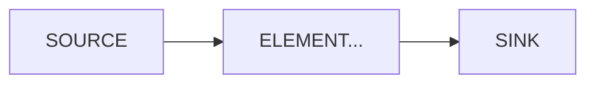
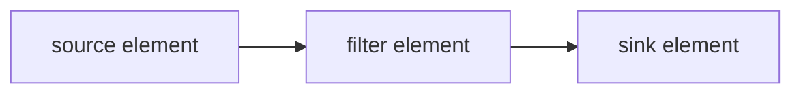
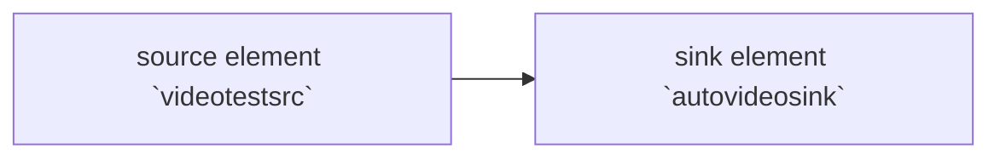

<div align=center><font face="黑体" size=6>教程</font></div>

[toc]

#### 1 Hello World

> 代码完成了打开窗口播放固定地址视频的功能，代码中没有延迟管理功能，如果需要解决这个问题，查看教程12。

##### 1.1 核心函数

###### 1. 初始化函数

```c
// gstreamer 初始化函数
gst_init(&argc, &argv);
```

初始化函数是执行GStreamer框架的第一个函数，函数作用:

* 初始化所有的内部结构
* 检查那些插件可用
* 执行GStreamer的任何命令行选项

命令行参数可以通过argc、argv参数传递给gst_int（更多的可以查看教程10，gstreamer工具）。

###### 2. gst_parse_launch函数

GStreamer框架被设计处理多媒体流，媒体从source元素组件是开始介入，从sink元素组件流出，中间通过各种各样的元素组件，进行流的任务处理，这些互相连接的元素组件集合叫做管道（Pipeline）。



在GStreamer中，您通常通过手动组装单个元素来构建管道，但是，当管道足够简单，并且您不需要任何高级功能时，您可以采取快捷方式：gst_parse_launch() 函数（函数接受文本并将其转换为实际的管道，教程10：GStreamer工具章节学习关于gst-launch和其语法）。

###### 3. palybin 

使用gst_parse_launch() 函数构建 playbin  元素的管道。

playbin 是一个特殊的元素组件，它包含了source和sink，是一个完整的管道。在内部，他创建并连接了播放媒体所需的所有元素。playbin元素组件不能够细粒度的控制管道内部的设置，但也提供了一些方式去使用，在本节可以使用playbin参数，请求网络资源或本地资源（http://  OR file://）。

如果文件资源在获取时出错，或者插件不存在，GStreamer提供了几种通知机制，我们需要做的是获取到通知后退出。

###### 4. gst_element_set_state函数

设置管道的状态，每一个GStreamer元素组件都有关联状态，这里将管道的状态设置为PLAYING。

```c
 /* Start playing */
 gst_element_set_state (pipeline, GST_STATE_PLAYING);
```

###### 5. gst_element_get_bus函数

```c
  /* Wait until error or EOS */
  bus = gst_element_get_bus (pipeline);
  msg =
      gst_bus_timed_pop_filtered (bus, GST_CLOCK_TIME_NONE,
      GST_MESSAGE_ERROR | GST_MESSAGE_EOS);
```

gst_element_get_bus函数获取管道总线，gst_bus_timed_pop_filtered函数通过bus总线获取接收错误ERROR或者EOS(流结束)。当管道中视频流结束、遇到错误（尝试关闭视频窗口或网路断开时）执行将结束。通过控制台control - c 可以随时停止应用。 

###### 6.释放资源函数

```c
 /* Free resources */
  gst_message_unref (msg);
  gst_object_unref (bus);
  gst_element_set_state (pipeline, GST_STATE_NULL);
  gst_object_unref (pipeline);
  return 0;
```

使用函数前请查阅接口文档，了解是否应该显式的释放函数返回的对象。

在本节，gst_bus_timed_pop_filtered （）返回了一条需要用gst_message_unref（）释放的消息（有关消息的更多信息，基础教程2: GStreamer概念会讲到）。

gst_element_get_bus（）添加了对总线的引用，必须使用gst_object_unref（）释放该引用。将管道设置为NULL状态将确保它释放已分配的任何资源（有关状态的更多信息，请参阅基础教程3：动态管道）。最后，取消对管道的引用。

##### 1.2 插件

**playbin**插件，playbin 是一个特殊的元素组件，它包含了source和sink，是一个完整的管道。在内部，他创建并连接了播放媒体所需的所有元素。playbin元素组件不能够细粒度的控制管道内部的设置，但也提供了一些方式去使用，在本节可以使用playbin参数，请求网络资源或本地资源（http://  OR file://）。

#### 2 Gstreamer 概念

> 在第1章教程展示了如何创建自动创建一个管道。在本章节我们将手动创建管道，初始化元素组件并将他们连接起来。在本本章节，我们将学习到：
>
> * 了解GStreamer元素组组件及创建
> * 元素组件件如何链接
> * 如何定义元素组件和组件的行为
> * 监听总线的错误情况，并从GStreamer消息抽取信息

##### 2.1 核心函数

###### 1. 管道

这些元素组件是GStreamer的基本构造块。它们在数据从源元素组件（数据生产者），通过过滤器元素组件处理吗，流向汇元素组件（数据消费者）的过程。



###### 2. 元素组件创建

这里跳过GStreamer初始化，初始化可以看上一个教程：

```c
 source = gst_element_factory_make ("videotestsrc", "source");
 sink = gst_element_factory_make ("autovideosink", "sink");
```

如这段代码所示，**gst_element_factory_make（)** 函数可以创建新的元素组件。第一个参数是要创建的元素类型（**基础教程14：**展示了一些常见的元素组件，**基础教程10：**GStreamer工具，显示了如何获取所有可用类型的列表）。第二个参数是我们想给这个实例起的名字，没用保留指针的情况下，名字可以被用来检索元素组件实例（更有意义的是debug的输出）。如果向参数传入NULL, GStreamer将会提供一个唯一的名字。

本教程创建了两个元素组件：`videotestsrc` 和 `autovideosink`，这张图中么有filter元素组件。管道图如下：



`videotestsrc`：是一个source元素组件，用于创建测试视频模式。此组件可用于调试，通常不在生产程序中使用。
`autovideosink`：是一个sink元素组件，它打开窗口显示它接收到的图像。根据操作系统的不同，这里存在几种具有不同功能的视频接收器。

`autovideosink`:会自动选择并实例化最佳的一个，所以不必担心细节，并且您的代码更加独立于平台。

###### 3. 管道创建


##### 2.2 插件

